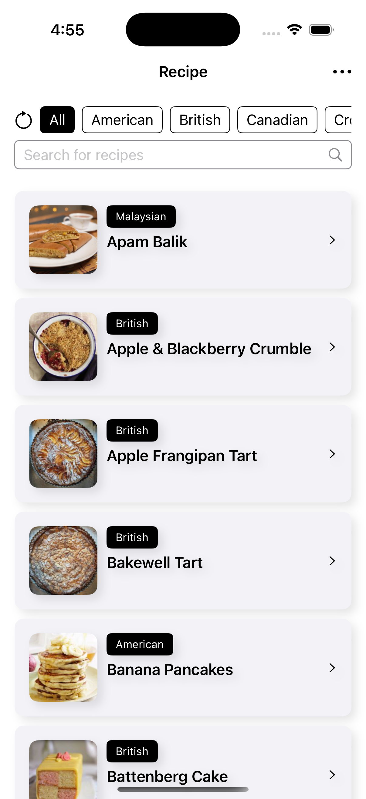

# FetchRecipeProject 🍽

## 🧠 Project Overview & Architecture

FetchRecipeProject is a recipe browsing app that lets users view, filter, and search through a collection of global recipes. It’s designed with a focus on user experience and clean architecture, using MVVM, SwiftUI, and Swift Concurrency to ensure a smooth, testable, and maintainable codebase.

---

## 🎥 Demo Videos

🔹 **[Demo Video](videos/demo.mp4)** – Full walkthrough of the recipe-fetching app.

## 🖼 Screenshots

  
  
  

  
  
  

  
  
  

---

## 🚀 App Features

- **Fetch Recipes** from remote JSON endpoints
- **Filter by Cuisine** with auto-generated scrollable list
- **Search Bar** for quick filtering by keyword
- **Image Caching** with both memory and disk support
- **Mock & Malformed Data** options for testing and preview
- **Error Handling** with custom `ServiceError` messaging
- **Dark Mode** and responsive SwiftUI layout
- **Unit Tests** for ViewModel and ImageCache using `Testing`

---

## 🧪 Focus Areas

I prioritized delivering a **smooth user experience** by focusing on both essential and enhanced features that users expect when browsing recipes:

- **Core Experience** – Users can easily view key recipe details such as the name, cuisine, large photo, source link, and YouTube video thumbnail.
- **Cuisine Filtering** – A scrollable selector allows users to browse recipes by specific cuisines.
- **Search Bar** – Users can quickly search for recipes by name or cuisine.

These features were chosen to make recipe exploration seamless and intuitive, helping users find what they want with minimal effort.

---

## ⏱ Time Spent

Approx. **6 hours**

- 0.5h – Architecture design (MVVM, dependency injection, separation of concerns)
- 2h – UI layout with SwiftUI (filter bar, search, recipe list, detail view)
- 1.5h – Network abstraction and data service model (decoding, error handling)
- 0.5h – ViewModel business logic (filtering, search, selection handling)
- 0.5h – Image loading and custom memory/disk caching
- 1h - Unit tests and mock data setup

---

## ⚖️ Trade-offs & Decisions

- Chose to use a **YouTube thumbnail image with a link** instead of embedding the video inline.  
  This avoids performance issues, improves initial load time, and gives users the flexibility to view the video in Safari or the YouTube app.
- Considered introducing a **dedicated dependency container** and encapsulating `RecipeManager` behind a protocol to limit access and enforce separation.  
  However, for simplicity and readability, I opted to use `@EnvironmentObject` to inject `RecipeManager`.  
  If the app were to grow in complexity or scale, I would refactor to adopt a more robust injection mechanism.
- Evaluated which **UI components should be extracted for reuse**.  
  I decided to modularize components that are not tightly coupled to specific views—like the **cuisine selection scroll view**, which I generalized into a **reusable, generic horizontal selector** for future use.

---

## 🧩 Weakest Part

- Limited in UI polish and animations due to prioritizing **functionality and architecture**.
- The **error handling UI** is minimal and could benefit from a more user-friendly, persistent design (e.g., banners or retry buttons).
- Does not include **persistence or offline support**, which would be useful for a recipe app.

---

## 📘 Additional Notes

- This project uses **MVVM architecture** to keep business logic **testable and well-structured**.
- It employs **dependency injection** and **protocol-oriented programming** for the recipe fetching service, making it easy to switch between different service implementations (e.g., real API, mock data) without changing the consumer logic.

---
